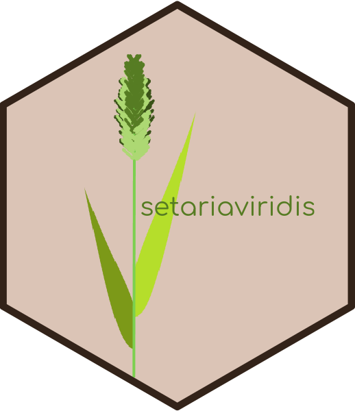

# setariaviridis 

Setaria viridis is a familiar weed.
This package is data measured for each branch of Setaria viridis
for practice data analysis. The data was collected from a wild Setaria viridis.

## Installation

You can install from GitHub use:

``` r
library(remotes)
install_github("NONONOexe/setariaviridis")
```
Sorry, It does not support CRAN now.
