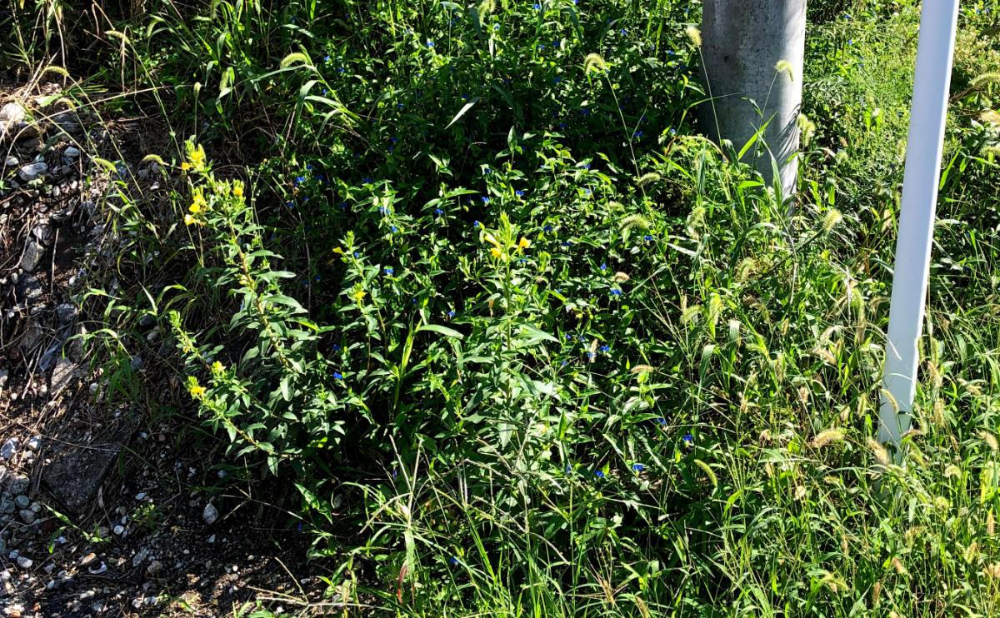
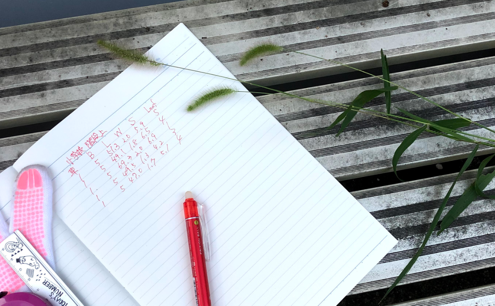
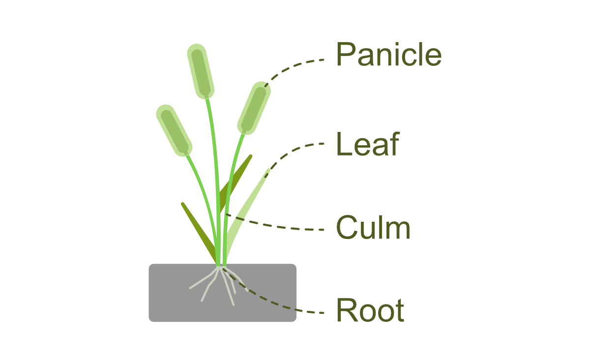
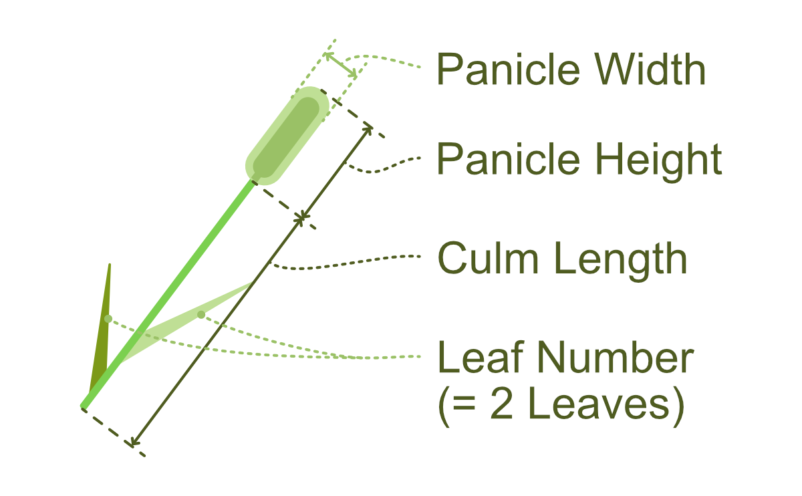
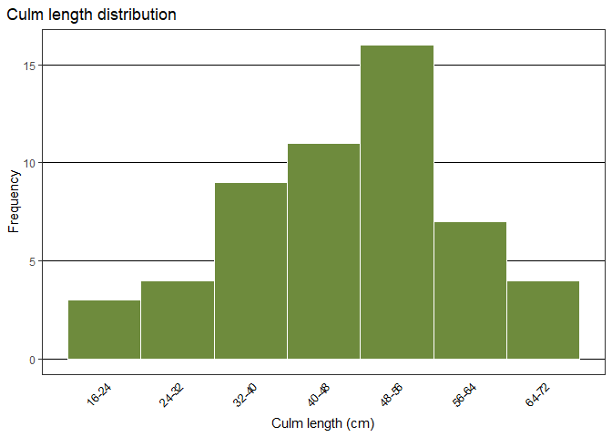
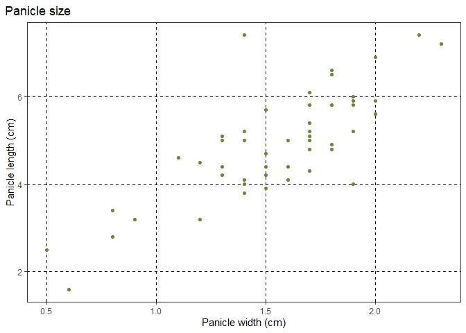

<!-- README.md is generated from README.Rmd. Please edit that file -->

# setariaviridis <a href="https://nononoexe.github.io/setariaviridis/"></a>

<!-- badges: start -->

[](https://lifecycle.r-lib.org/articles/stages.html#stable)
[](https://CRAN.R-project.org/package=setariaviridis)
[](https://github.com/NONONOexe/setariaviridis/actions/workflows/R-CMD-check.yaml)
<!-- badges: end -->

## Overview

*Setaria viridis* (green foxtail, ネコジャラシ) is a common weed. This
package contains measurements from individual branches of a wild
*Setaria viridis* plant collected near the author’s home.

The dataset is intended for practicing basic data analysis techniques.
It’s ideal for learning how to calculate basic descriptive statics,
create visualizations such as histograms and scatter plots, and gain
experience with data manipulation and exploration using R. Its
relatively small size and straightforward structure make this dataset
easy to work with for beginners in data analysis.

## Installation

You can install the setariaviridis using the following methods:

### CRAN version

``` r
install.packages("setariaviridis")
```

### Development version

#### Using `install.packages()` (R-universe)

``` r
# Enable the R-universe
options(repos = c(
  nononoexe = "https://nononoexe.r-universe.dev",
  cran = "https://cloud.r-project.org"
))

# Install the package
install.packages("setariaviridis")
```

#### Using `pak`

``` r
# install.packages("pak")
pak::pak("NONONOexe/setariaviridis")
```

## About the data

The data in this package comprises measurements of *Setaria viridis*
collected by the author around their home in Aichi Prefecture, Japan.



This data was obtained in August 2021 by hand-harvesting Setaria viridis
plants, root and all, from a dense population. Measurements of each
plant part were taken manually using a tape measure and a ruler.



The data can be accessed as follows:

``` r
library(setariaviridis)
data(package = "setariaviridis")
head(setaria_viridis)
#>   root_number culm_length panicle_width panicle_length leaf_number
#> 1           1        69.3           2.0            6.9           1
#> 2           1        49.5           1.3            4.2           3
#> 3           1        49.1           1.8            6.5           4
#> 4           1        47.0           1.7            5.1           4
#> 5           1        51.3           2.0            5.9           5
#> 6           2        51.6           1.9            5.8           3
```

If you want to see for more info: `?setaria_viridis`

The data contains of 54 branches across 10 *Setaria viridis* plants.
*Setaria viridis* consists of 4 parts: panicle, leaf, culm, and root, as
illustrated in the figure below:



Data sharing the same roots can be identified by the `root_number`. For
all other measurement items, please refer to the following figure to
understand which parts were measured:



## Example

Using setariaviridis, you can visualize like followings:





## Code of conduct

Please note that this project is released with a [Contributor Code of
Conduct](https://nononoexe.github.io/setariaviridis/CODE_OF_CONDUCT.html).
By participating in this project you agree to abide by its terms.
